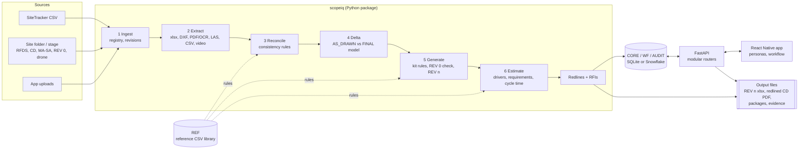

# ScopeIQ architecture

ScopeIQ turns a site's document stack into a reconciled scope, for each of the three streams defined in
`Condensed-Scope-Definition.xlsx`:

* **Site Build BOM Scoping**: the REV n BOM with redlines and RFIs.
* **Site Design Scoping**: the design checks only.
* **Network Deployment Scoping**: the BOM plus deployment drivers and site requirements.

The document stack is the RFDS, the CDs, the MA/SA, the drone capture and the REV 0 BOM. The logic follows sections 6
to 11 of the ScopeIQ internal team guide.

Steps 7 to 9 of the guide (review, the CX SP handshake, and Final BOM Approval) are run by the **workflow engine**
on top of the stored results.

## 1. Principles

| Principle | How it is applied |
|---|---|
| Governing source per domain | The RFDS governs RF configuration. The field (drone) governs physical conditions: pipes, sleds, cable route, unrecorded equipment. The MA governs mount modifications. Every finding records the governing source. |
| Separate tool errors from scope changes | The rules run twice: on the CD **as drawn** (which must reproduce REV 0) and on the **final** model (RFDS plus field plus MA). Differences between REV 0 and the as-drawn result are tool errors (RC-REV0-ERR). Differences between the as-drawn and final models are field or document changes, each with its own reason code. |
| Never assume | A route outside tolerance takes the field value. A missing route holds the trunk and raises CBL-01. Low-confidence values are queued for review (EXT-01). |
| Rules are data | Kit rules, consistency rules, trunk steps, driver matrix, rate card, site requirements, cycle-time parameters, reason codes, personas and the workflow all live in `reference_data/*.csv`. They are versioned and effective-dated, and loaded into `REF.*`. Changing behaviour means editing a row, not code. |
| One schema, two backends | `scopeiq/db/schema.py` generates both the SQLite DDL and the Snowflake DDL, and the same repository interface runs on SQLite, Snowflake or Snowpark. |
| Immutable approvals | A locked state (for example an approved or FBA BOM revision) rejects edits with `SIQ-LOCK-409`. Any later change makes a new revision. |
| Everything traceable | Every BOM line carries the rule, the source sheet and the reason code. Every human change needs a reason code and is written to `AUDIT.AUDIT_LOG`. A correlation id follows each request through the logs, the audit trail and the errors. |

## 2. Backend modules (`code/backend`)

| Module | Responsibility |
|---|---|
| `scopeiq/config` | Settings: `base.yaml`, then `<env>.yaml`, then the `.env` file, then `SCOPEIQ__*` environment variables |
| `scopeiq/common/logging.py` | Reusable logging: JSON or text format, context filter (correlation id, user, site), PII masking, rotating file, database sink, `@log_call` timing decorator, slow-call warnings |
| `scopeiq/common/errors.py` | `AppError` hierarchy with stable codes and HTTP status; `ErrorRecorder` writes `AUDIT.ERROR_LOG`; `@wrap_errors` decorator |
| `scopeiq/common/audit.py` | `AuditTrail.record(...)`: before/after values, reason code (required for human edits), actor, correlation id |
| `scopeiq/common/context.py` | Per-request and per-run context (contextvars) |
| `scopeiq/reference/*` | Reference library loader (CSV or database), catalog resolution (P/N, model, OCR fuzzy match), safe rule expressions |
| `scopeiq/extract/*` | One extractor per source: registry/revisions, RFDS (xlsx/pdf), CD (DXF and OCR of PDF), MA/SA, REV 0, drone (vendor CSV, point cloud, video frames), SiteTracker |
| `scopeiq/engine/facts.py` | Builds the site facts from the extractors; one failing extractor becomes a warning, not a failed run |
| `scopeiq/engine/reconcile.py` | Consistency checks registered with `@check`, gated by the `ACTIVE` and `STREAMS` columns of `consistency_rules.csv` |
| `scopeiq/engine/design.py` | AS_DRAWN and FINAL site models; equipment delta (new, existing, removed, relocated, reused) |
| `scopeiq/engine/bom.py` | Kit-rule engine driven by `kit_rules.csv` trigger codes; trunk sizing from `trunk_steps.csv` |
| `scopeiq/engine/revisions.py` | REV 0 validation (BOM-01 to BOM-05), and REV 0 to REV n change list with reason codes |
| `scopeiq/engine/drivers.py` | Site requirements (access, rigging, holds, EH&S), service drivers, cycle time and estimate |
| `scopeiq/engine/redlines.py` | Redline markups and RFI drafts from findings, with routing to A&E or Ericsson |
| `scopeiq/outputs/*` | BOM workbook (REV 0 tool columns plus traceability), red-marked CD PDF, site packages |
| `scopeiq/workflow/engine.py` | Table-driven state machine: roles, reason and comment requirements, events, notifications, locking |
| `scopeiq/db/*` | Schema registry, DDL generation, repositories (SQLite, Snowflake, Snowpark) |
| `scopeiq/services/pipeline.py` | Orchestration and idempotent persistence: human decisions survive re-runs |
| `scopeiq/services/snowpark_entry.py` | Stored-procedure entry point: stage files in, pipeline, stage files out |
| `api/` | FastAPI app: middleware (correlation id, access log, payload logging, error envelope) and one router per area: auth, sites, documents, pipeline, discrepancies, redlines and RFIs, BOM, estimate, workflow, admin |

## 3. Consistency rules (reconciliation)

| Family | Rules | Compares |
|---|---|---|
| Documents | DOC-01, DOC-02, REV-01, REV-02 | required documents per stream; duplicates; RFDS revision referenced by CD and MA |
| Extraction | EXT-01 | values below the confidence threshold, or not matched to the catalog |
| Analyses | SA-01, MA-01, MNT-01, LOAD-01 | SA/MA results; mount modifications missing from REV 0; added load against the analysis |
| RFDS vs CD | RFC-01 to RFC-06 | azimuth, equipment model and position, RAD centre, sector count |
| CD vs field | FLD-01 to FLD-07 | unrecorded equipment, missing pipes or sleds, RAD centre, azimuth, cable route, extra devices |
| Cabling | CBL-01 | trunk route not documented anywhere |
| BOM | BOM-01 to BOM-05 | missing lines, wrong quantities, duplicates, non-approved parts, extra lines |

Each rule row carries severity, outcome (REDLINE, RFI, BOM_CHANGE, ESCALATE, REVIEW), target document, parameters,
the streams it applies to, and its version.

## 4. Data model (summary; full list in DATA_MODEL.md)

| Layer | Contents |
|---|---|
| RAW | SiteTracker landing tables; in Snowflake also the stages, `FILE_REGISTRY` and `DOC_PARSE` |
| REF | 13 reference tables built from `reference_data/*.csv` |
| CORE | SITE, MILESTONE, DOCUMENT, UPLOAD, PIPELINE_RUN, EXTRACTED_FIELD, CONFIG_LINE, SECTOR_INFO, TRUNK_MEASURE, ANALYSIS_RESULT, REV0_LINE, FIELD_OBJECT, EVIDENCE_FRAME, DISCREPANCY, EQUIPMENT_DELTA, BOM_REVISION, BOM_LINE, BOM_CHANGE, DRIVER_LINE, SITE_REQUIREMENT, ESTIMATE, EHS_ALERT, REDLINE, RFI |
| WF | WORKFLOW_EVENT, NOTIFICATION, COMMENT |
| AUDIT | AUDIT_LOG (immutable), APP_LOG, ERROR_LOG |

## 5. Mobile app (`code/mobile`)

The app is built with Expo (SDK 57) and Expo Router, in TypeScript, and runs on iOS, Android and the web from one codebase.

| Folder | Contents |
|---|---|
| `src/app/` | Routes: login, tabs (dashboard, sites, work queue, inbox, more), site workbench, discrepancy, BOM revision, upload, audit, reference data, logs |
| `src/components/` | Reusable UI (cards, badges, chips, error view, environment banner), `WorkflowActions` (actions with reason-code prompts), `ErrorBoundary`, one component per site tab |
| `src/lib/` | API client (token, correlation id, error type), auth context (mock login), data hook, logger, environment config |
| `config/<env>.json` + `app.config.ts` | Environment selection with `APP_ENV`; `SCOPEIQ_API_URL` overrides the API address |

The server returns the actions each persona can take, so the app holds no workflow rules of its own.

## 6. Snowflake deployment

`snowflake/` holds numbered scripts with per-environment variables. The pipeline runs as a Snowpark Python procedure
built from the same package, triggered by a stream on the document stage. A Snowpark Container Services job spec covers
OCR-heavy runs. Reporting views are in the `APP` schema. See `snowflake/EXECUTION_GUIDE.md`.

## 7. Extending

| To | Do |
|---|---|
| Add a kit rule | add a row to `reference_data/kit_rules.csv` (trigger code, part, quantity expression, version, effective date); reload |
| Change a tolerance or threshold | edit `PARAMS_JSON` in `consistency_rules.csv`, or `engine.*` in the config |
| Add a consistency check | write a function decorated with `@check` in `engine/reconcile.py` and add its rule row |
| Add a workflow step | add rows to `workflow_states.csv` and `workflow_transitions.csv`; the API and the app pick them up |
| Add a document type | add a classification rule in `extract/registry.py` (and in the `FILE_REGISTRY` view), plus an extractor |
| Add a carrier or market | rows with `CARRIER` or `MARKET` values in the rule and rate tables |
