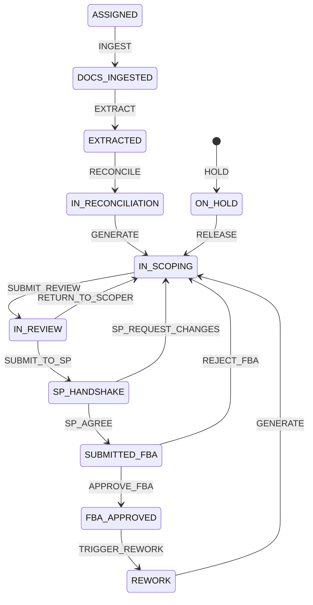
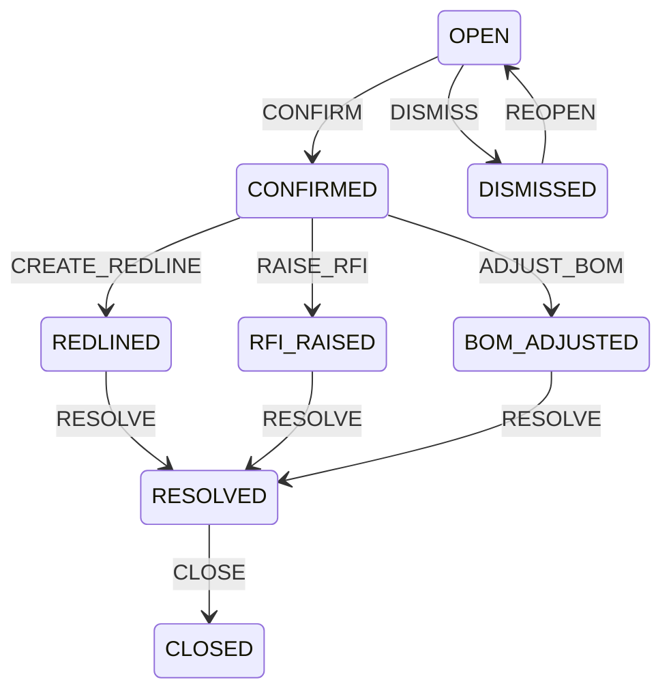
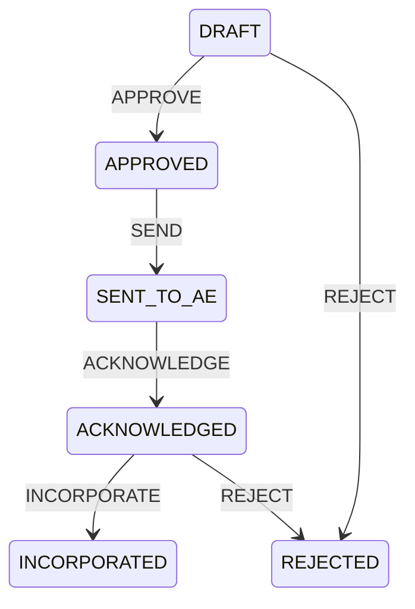
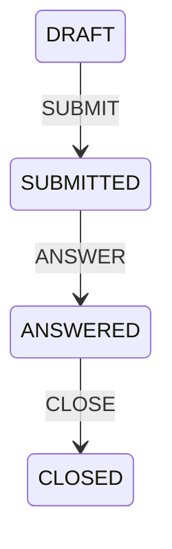
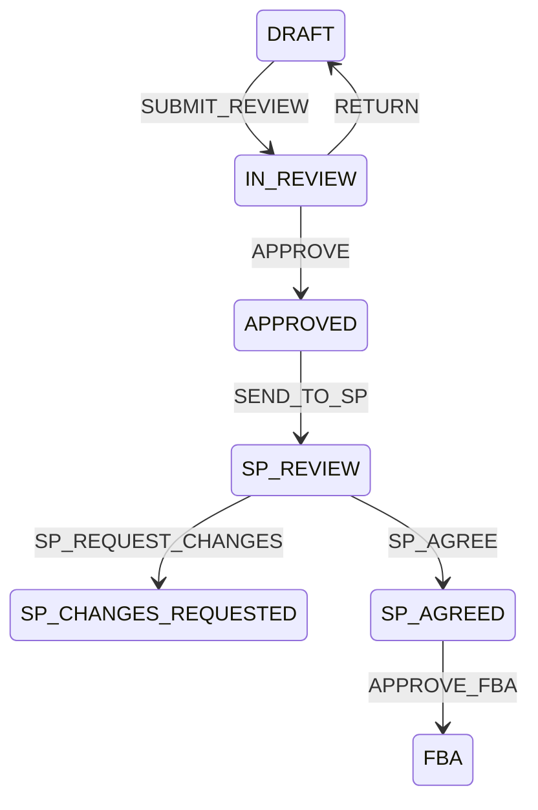
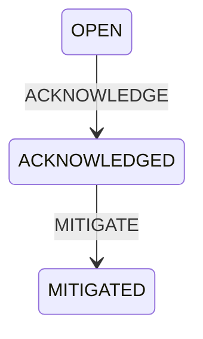

# Personas and workflows
Generated from `reference_data/personas.csv`, `users.csv`, `workflow_states.csv` and `workflow_transitions.csv` by `backend/scripts/generate_docs.py`. The workflow engine reads the same rows at run time, so changing a CSV (and reloading reference data) changes the behaviour; no code change is needed.
## Personas
| Role | Persona | Organisation | Goals | Key screens | Can approve | Data scope | Snowflake role |
|---|---|---|---|---|---|---|---|
| SCOPER | Scoping Engineer | Innosquares (offshore scoping team) | Turn a site's document stack into a correct REV n BOM, redlines and RFIs first time; confirm or dismiss every automated finding with a reason code | Inbox; Site workbench; Discrepancies; Redlines; BOM editor; Drone evidence; Uploads | N | Assigned market sites | SCOPEIQ_SCOPER |
| REVIEWER | Scoping Lead / QA Reviewer | Innosquares (supplier lead CM/PM) | Quality-review scoper output, approve and lock BOM revisions, approve redlines and RFIs before they leave, track FTR and TAT | Dashboard; Approval queue; BOM diff; Redline approval; Audit | Y | Market sites | SCOPEIQ_REVIEWER |
| CX_SP | Construction Service Provider | CX SP (e.g. Prairie Tower Services) | Review BOM, SoW and service drivers; agree or request changes in the handshake; see crane/rigging needs for the quote | SP review; BOM (read); Drivers and requirements; Change requests | N | Sites assigned to the SP only | SCOPEIQ_SP |
| ERICSSON | Ericsson Scoping Lead / CM | Ericsson (customer) | Answer RFIs, give Final BOM Approval, see status and quote packs | Dashboard; RFIs; FBA approval; Reports | Y | All program sites (read) + FBA | SCOPEIQ_ERICSSON_VIEWER |
| AE_ENGINEER | A&E Engineer | A&E firm (e.g. Meridian A&E Group) | Receive redlines, acknowledge, and register the corrected document revision | Redline inbox; Document upload | N | Redlines addressed to the firm | SCOPEIQ_AE |
| EHS | EH&S Manager | Ericsson EH&S | Receive safety and structural alerts (SA fail, guyed, rooftop) and acknowledge mitigation | EH&S alerts; Site requirements | N | Alerts only | SCOPEIQ_EHS |
| ADMIN | Platform Administrator | Innosquares | Manage users, reference data, rule sets and environment settings | Admin; Reference data; Rules; Logs | Y | Everything | SCOPEIQ_ADMIN |

## Demo users (mock login: pick a user, any non-empty password)
| User id | Name | Role | Organisation | Service provider |
|---|---|---|---|---|
| scoper1 | Asha Rao (Scoper) | SCOPER | Innosquares |  |
| scoper2 | Vikram Iyer (Scoper) | SCOPER | Innosquares |  |
| reviewer1 | Dana Brooks (Scoping Lead) | REVIEWER | Innosquares |  |
| sp_prairie | Prairie Tower Services PM | CX_SP | Prairie Tower Services (synthetic) | Prairie Tower Services (synthetic) |
| sp_brazos | Brazos Wireless PM | CX_SP | Brazos Wireless Construction (synthetic) | Brazos Wireless Construction (synthetic) |
| sp_redline | Redline Constructors PM | CX_SP | Redline Constructors (synthetic) | Redline Constructors (synthetic) |
| ericsson1 | Ericsson Scoping Lead | ERICSSON | Ericsson |  |
| ae1 | Meridian A&E Engineer | AE_ENGINEER | Meridian A&E Group (synthetic) |  |
| ehs1 | EH&S Manager | EHS | Ericsson |  |
| admin | Platform Admin | ADMIN | Innosquares |  |

## Workflow tracking

Every transition writes `WF.WORKFLOW_EVENT` (from, action, to, actor, role, reason, comment, correlation id), an `AUDIT.AUDIT_LOG` row, and inbox notifications (`WF.NOTIFICATION`) for the roles listed. `*` as a from-state means the action is allowed from any state. A locked state makes the record immutable (for example an approved BOM revision: further changes need a new revision).

### SITE_SCOPING

States

| Seq | State | Initial | Terminal | Locked | Owner | Meaning |
|---|---|---|---|---|---|---|
| 10 | ASSIGNED | Y | N | N | SCOPER | Site assigned from tool of record; documents expected |
| 20 | DOCS_INGESTED | N | N | N | SCOPER | All required documents registered (latest revisions resolved) |
| 30 | EXTRACTED | N | N | N | SCOPER | Documents read; low-confidence fields queued for review |
| 40 | IN_RECONCILIATION | N | N | N | SCOPER | Consistency rules run; discrepancies being confirmed |
| 50 | IN_SCOPING | N | N | N | SCOPER | Delta + REV n BOM + drivers generated; scoper editing |
| 60 | IN_REVIEW | N | N | N | REVIEWER | Scoping package with the reviewer |
| 70 | SP_HANDSHAKE | N | N | N | CX_SP | BOM/SoW/drivers submitted to the CX SP |
| 80 | SUBMITTED_FBA | N | N | N | ERICSSON | Final revision submitted for Final BOM Approval |
| 90 | FBA_APPROVED | N | N | Y | ERICSSON | Final BOM Approval given - invoiceable; revision locked |
| 95 | REWORK | N | N | N | SCOPER | Post-FBA change (material availability / GC change / rapid response) |
| 99 | ON_HOLD | N | N | N | REVIEWER | Blocked (RFI outstanding or structure fails SA) |

Transitions

| From | Action | To | Allowed roles | Reason code | Comment | Notifies | Meaning |
|---|---|---|---|---|---|---|---|
| ASSIGNED | INGEST | DOCS_INGESTED | SCOPER, ADMIN, SYSTEM | N | N | SCOPER | Documents registered |
| DOCS_INGESTED | EXTRACT | EXTRACTED | SCOPER, ADMIN, SYSTEM | N | N | SCOPER | Extraction finished |
| EXTRACTED | RECONCILE | IN_RECONCILIATION | SCOPER, ADMIN, SYSTEM | N | N | SCOPER | Consistency rules run |
| IN_RECONCILIATION | GENERATE | IN_SCOPING | SCOPER, ADMIN, SYSTEM | N | N | SCOPER | REV n generated |
| IN_SCOPING | SUBMIT_REVIEW | IN_REVIEW | SCOPER | N | N | REVIEWER | Scoper submits package for QA |
| IN_REVIEW | RETURN_TO_SCOPER | IN_SCOPING | REVIEWER | Y | Y | SCOPER | Reviewer sends back |
| IN_REVIEW | SUBMIT_TO_SP | SP_HANDSHAKE | REVIEWER | N | N | CX_SP | Approved package to SP |
| SP_HANDSHAKE | SP_REQUEST_CHANGES | IN_SCOPING | CX_SP | Y | Y | SCOPER, REVIEWER | SP change request creates next revision |
| SP_HANDSHAKE | SP_AGREE | SUBMITTED_FBA | CX_SP | N | N | ERICSSON, REVIEWER | SP agreed BOM and SoW |
| SUBMITTED_FBA | APPROVE_FBA | FBA_APPROVED | ERICSSON | N | N | REVIEWER, SCOPER | Final BOM Approval |
| SUBMITTED_FBA | REJECT_FBA | IN_SCOPING | ERICSSON | Y | Y | REVIEWER, SCOPER | Ericsson rejects |
| FBA_APPROVED | TRIGGER_REWORK | REWORK | ERICSSON, REVIEWER | Y | Y | SCOPER | Post-FBA change |
| REWORK | GENERATE | IN_SCOPING | SCOPER, SYSTEM | N | N | SCOPER | Next revision generated |
| * | HOLD | ON_HOLD | REVIEWER, ERICSSON, EHS, ADMIN, SYSTEM | Y | Y | SCOPER, REVIEWER | Put on hold |
| ON_HOLD | RELEASE | IN_SCOPING | REVIEWER, ERICSSON, ADMIN | Y | Y | SCOPER | Release hold |

### DISCREPANCY

States

| Seq | State | Initial | Terminal | Locked | Owner | Meaning |
|---|---|---|---|---|---|---|
| 10 | OPEN | Y | N | N | SCOPER | Raised by a rule; awaiting scoper confirmation |
| 20 | CONFIRMED | N | N | N | SCOPER | Scoper confirmed it is real |
| 30 | DISMISSED | N | Y | N | SCOPER | Scoper dismissed it (reason code required) |
| 40 | REDLINED | N | N | N | REVIEWER | Redline item created and pending A&E |
| 45 | RFI_RAISED | N | N | N | ERICSSON | RFI sent to Ericsson |
| 48 | BOM_ADJUSTED | N | N | N | SCOPER | Handled through a BOM change |
| 50 | RESOLVED | N | N | N | REVIEWER | Corrected document received / RFI answered |
| 60 | CLOSED | N | Y | N | REVIEWER | Closed by reviewer |

Transitions

| From | Action | To | Allowed roles | Reason code | Comment | Notifies | Meaning |
|---|---|---|---|---|---|---|---|
| OPEN | CONFIRM | CONFIRMED | SCOPER, REVIEWER | N | N |  | Scoper confirms |
| OPEN | DISMISS | DISMISSED | SCOPER, REVIEWER | Y | Y | REVIEWER | Scoper dismisses |
| CONFIRMED | CREATE_REDLINE | REDLINED | SCOPER, REVIEWER | N | N | REVIEWER | Redline drafted |
| CONFIRMED | RAISE_RFI | RFI_RAISED | SCOPER, REVIEWER | N | N | ERICSSON | RFI raised |
| CONFIRMED | ADJUST_BOM | BOM_ADJUSTED | SCOPER, REVIEWER | N | N | REVIEWER | Handled in the BOM |
| REDLINED | RESOLVE | RESOLVED | REVIEWER, AE_ENGINEER | Y | N | SCOPER | Corrected document received |
| RFI_RAISED | RESOLVE | RESOLVED | REVIEWER, ERICSSON | Y | N | SCOPER | RFI answered |
| BOM_ADJUSTED | RESOLVE | RESOLVED | REVIEWER | N | N | SCOPER | BOM change approved |
| RESOLVED | CLOSE | CLOSED | REVIEWER | N | N |  | Closed |
| DISMISSED | REOPEN | OPEN | REVIEWER | Y | Y | SCOPER | Reopened |

### REDLINE

States

| Seq | State | Initial | Terminal | Locked | Owner | Meaning |
|---|---|---|---|---|---|---|
| 10 | DRAFT | Y | N | N | SCOPER | Generated or drafted by the scoper |
| 20 | APPROVED | N | N | N | REVIEWER | Reviewer approved the redline for release |
| 30 | SENT_TO_AE | N | N | N | AE_ENGINEER | Redline pack sent to the A&E firm |
| 40 | ACKNOWLEDGED | N | N | N | AE_ENGINEER | A&E acknowledged |
| 50 | INCORPORATED | N | Y | N | AE_ENGINEER | Corrected revision issued |
| 60 | REJECTED | N | Y | N | AE_ENGINEER | A&E rejected (justification required) |

Transitions

| From | Action | To | Allowed roles | Reason code | Comment | Notifies | Meaning |
|---|---|---|---|---|---|---|---|
| DRAFT | APPROVE | APPROVED | REVIEWER | N | N | SCOPER | Reviewer approves |
| DRAFT | REJECT | REJECTED | REVIEWER | Y | Y | SCOPER | Reviewer rejects draft |
| APPROVED | SEND | SENT_TO_AE | REVIEWER, SCOPER | N | N | AE_ENGINEER | Sent to A&E |
| SENT_TO_AE | ACKNOWLEDGE | ACKNOWLEDGED | AE_ENGINEER | N | N | SCOPER | A&E acknowledged |
| ACKNOWLEDGED | INCORPORATE | INCORPORATED | AE_ENGINEER | Y | N | SCOPER, REVIEWER | New revision issued |
| ACKNOWLEDGED | REJECT | REJECTED | AE_ENGINEER | Y | Y | SCOPER, REVIEWER | A&E rejects |

### RFI

States

| Seq | State | Initial | Terminal | Locked | Owner | Meaning |
|---|---|---|---|---|---|---|
| 10 | DRAFT | Y | N | N | SCOPER | Drafted from a discrepancy |
| 20 | SUBMITTED | N | N | N | ERICSSON | Submitted to Ericsson |
| 30 | ANSWERED | N | N | N | SCOPER | Ericsson answered |
| 40 | CLOSED | N | Y | N | REVIEWER | Answer applied and closed |

Transitions

| From | Action | To | Allowed roles | Reason code | Comment | Notifies | Meaning |
|---|---|---|---|---|---|---|---|
| DRAFT | SUBMIT | SUBMITTED | REVIEWER, SCOPER | N | N | ERICSSON | RFI submitted |
| SUBMITTED | ANSWER | ANSWERED | ERICSSON | N | Y | SCOPER | Ericsson answers |
| ANSWERED | CLOSE | CLOSED | REVIEWER, SCOPER | N | N |  | Closed |

### BOM_REVISION

States

| Seq | State | Initial | Terminal | Locked | Owner | Meaning |
|---|---|---|---|---|---|---|
| 10 | REV0_RECEIVED | Y | N | Y | SCOPER | Ericsson preliminary REV 0 (read-only) |
| 20 | DRAFT | Y | N | N | SCOPER | REV n generated by rules plus scoper edits |
| 30 | IN_REVIEW | N | N | N | REVIEWER | With the reviewer |
| 40 | APPROVED | N | N | Y | REVIEWER | Approved and locked by the reviewer |
| 50 | SP_REVIEW | N | N | Y | CX_SP | With the CX SP for the handshake |
| 55 | SP_CHANGES_REQUESTED | N | Y | Y | SCOPER | SP asked for changes - next revision required |
| 60 | SP_AGREED | N | N | Y | ERICSSON | SP agreed BOM and SoW |
| 70 | FBA | N | Y | Y | ERICSSON | Final BOM Approval - never editable |
| 80 | SUPERSEDED | N | Y | Y |  | Replaced by a later revision |

Transitions

| From | Action | To | Allowed roles | Reason code | Comment | Notifies | Meaning |
|---|---|---|---|---|---|---|---|
| DRAFT | SUBMIT_REVIEW | IN_REVIEW | SCOPER | N | N | REVIEWER | Submitted to reviewer |
| IN_REVIEW | RETURN | DRAFT | REVIEWER | Y | Y | SCOPER | Returned to scoper |
| IN_REVIEW | APPROVE | APPROVED | REVIEWER | N | N | SCOPER | Approved and locked |
| APPROVED | SEND_TO_SP | SP_REVIEW | REVIEWER | N | N | CX_SP | Handshake starts |
| SP_REVIEW | SP_REQUEST_CHANGES | SP_CHANGES_REQUESTED | CX_SP | Y | Y | SCOPER, REVIEWER | SP change request |
| SP_REVIEW | SP_AGREE | SP_AGREED | CX_SP | N | N | ERICSSON, REVIEWER | SP agrees |
| SP_AGREED | APPROVE_FBA | FBA | ERICSSON | N | N | REVIEWER, SCOPER | Final BOM Approval |

### EHS_ALERT

States

| Seq | State | Initial | Terminal | Locked | Owner | Meaning |
|---|---|---|---|---|---|---|
| 10 | OPEN | Y | N | N | EHS | Safety / structural alert raised |
| 20 | ACKNOWLEDGED | N | N | N | EHS | EH&S acknowledged |
| 30 | MITIGATED | N | Y | N | EHS | Mitigation recorded |

Transitions

| From | Action | To | Allowed roles | Reason code | Comment | Notifies | Meaning |
|---|---|---|---|---|---|---|---|
| OPEN | ACKNOWLEDGE | ACKNOWLEDGED | EHS | N | N | REVIEWER | EH&S acknowledges |
| ACKNOWLEDGED | MITIGATE | MITIGATED | EHS | N | Y | REVIEWER | Mitigation recorded |

## Reason codes

| Code | Category | Description | Fault party | Applies to |
|---|---|---|---|---|
| RC-DOC-CONFLICT | Discrepancy | Documents conflict; following the governing document (RFDS governs RF) | A&E | DISCREPANCY, BOM_LINE |
| RC-FIELD-COND | Discrepancy | Field condition differs from drawings (drone evidence) | A&E | DISCREPANCY, BOM_LINE |
| RC-MA-REQ | Discrepancy | Mount/structural analysis requirement | A&E | DISCREPANCY, BOM_LINE |
| RC-REV0-ERR | BOM | Ericsson REV 0 tool error corrected | ERICSSON | BOM_LINE |
| RC-RULE-APPLIED | BOM | Line produced by kitting rules | NONE | BOM_LINE |
| RC-SCOPER-CORR | BOM | Scoper correction of generated line | INNOSQUARES | BOM_LINE |
| RC-SP-REQUEST | Handshake | CX SP change request accepted | SP | BOM_LINE, BOM_REVISION |
| RC-MAT-AVAIL | Rework | Material availability substitution | ERICSSON | BOM_REVISION |
| RC-GC-CHANGE | Rework | General contractor / SP change after FBA | SP | BOM_REVISION |
| RC-RAPID-RESP | Rework | Rapid response rework | ERICSSON | BOM_REVISION |
| RC-OWN-ERROR | Rework | Rework caused by our own error (no charge) | INNOSQUARES | BOM_REVISION, BOM_LINE |
| RC-FALSE-POS | Discrepancy | Not a real discrepancy (false positive) | NONE | DISCREPANCY |
| RC-DUPLICATE | Discrepancy | Duplicate of another discrepancy | NONE | DISCREPANCY |
| RC-ACCEPT-RISK | Discrepancy | Accepted by Ericsson without change | ERICSSON | DISCREPANCY |
| RC-AE-REVISED | Redline | A&E issued a corrected revision | A&E | REDLINE, DISCREPANCY |
| RC-AE-REJECTED | Redline | A&E rejected the redline with justification | A&E | REDLINE |
| RC-RFI-ANSWERED | RFI | Ericsson answered the RFI | ERICSSON | RFI, DISCREPANCY |
| RC-DATA-FIX | Admin | Reference data correction | NONE | REFERENCE |
| RC-OTHER | General | Other (comment required) | NONE | ALL |
